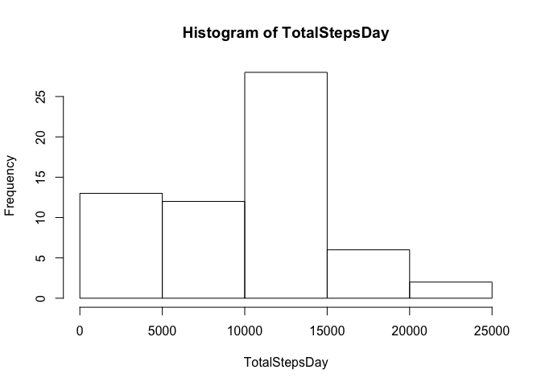
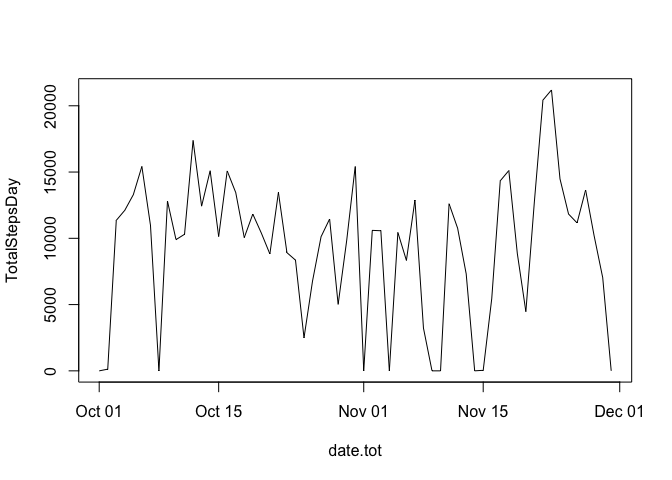
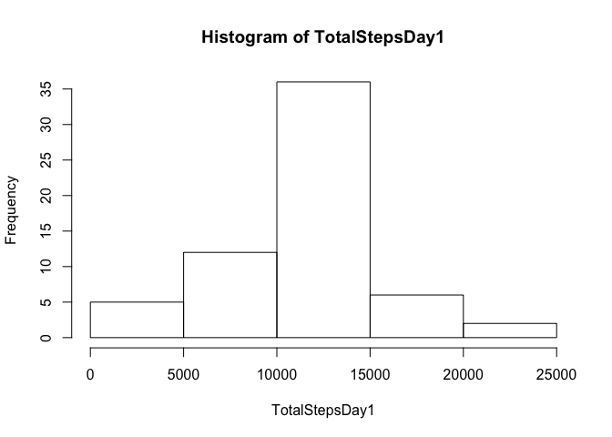

  
  
## Loading and preprocessing the data
  
  ```r
  library(xtable)
  setwd("/Users/thaissb1/Desktop")
  activity <- read.csv("activity.csv", head=T, sep=",")
  ```
  
  
## What is mean total number of steps taken per day?
  
  ```r
  TotalStepsDay <-  tapply(activity$steps, INDEX=activity$date, FUN=sum, na.rm=T)
  hist(TotalStepsDay)
  ```
  
  <!-- -->
  
  ```r
  xt <- xtable(data.frame(Mean=mean(TotalStepsDay), Median=median(TotalStepsDay)))
  print(xt, type="html")
  ```
  
  <!-- html table generated in R 3.4.3 by xtable 1.8-2 package -->
  <!-- Thu Apr 12 22:49:43 2018 -->
  <table border=1>
  <tr> <th>  </th> <th> Mean </th> <th> Median </th>  </tr>
    <tr> <td align="right"> 1 </td> <td align="right"> 9354.23 </td> <td align="right"> 10395 </td> </tr>
     </table>
  
  
## What is the average daily activity pattern?
1. Make a time series plot (i.e. 𝚝𝚢𝚙𝚎 = "𝚕") of the 5-minute interval (x-axis) and the average number of steps taken, averaged across all days (y-axis)


```r
date.tot <- as.Date(row.names(TotalStepsDay), format="%Y-%m-%d")
plot(date.tot, TotalStepsDay, type="l")
```

<!-- -->

2. Which 5-minute interval, on average across all the days in the dataset, contains the maximum number of steps?

```r
  TotalStepsInt <- tapply(activity$steps, INDEX=activity$interval, FUN=mean, na.rm=T, simplify = T)
  sort(TotalStepsInt, decreasing = T)[1]
```

```
##      835 
## 206.1698
```

## Imputing missing values
1. Calculate and report the total number of missing values in the dataset (i.e. the total number of rows with 𝙽𝙰s)

```r
total.na <- sum(is.na(activity))
```

2. Devise a strategy for filling in all of the missing values in the dataset. The strategy does not need to be sophisticated. For example, you could use the mean/median for that day, or the mean for that 5-minute interval, etc.

```r
activity1 <- activity
activity1$steps <- replace(activity1$steps, is.na(activity1$steps), tapply(activity1$steps, INDEX=activity1$interval, FUN=mean, na.rm=T))

TotalStepsDay1 <-  tapply(activity1$steps, INDEX=activity1$date, FUN=sum, na.rm=T) 
hist(TotalStepsDay1)
```

<!-- -->

```r
xt1 <- xtable(data.frame(Mean=mean(TotalStepsDay1), Median=median(TotalStepsDay1)))
print(xt1, type="html")
```

```
## <!-- html table generated in R 3.4.3 by xtable 1.8-2 package -->
## <!-- Thu Apr 12 22:49:44 2018 -->
## <table border=1>
## <tr> <th>  </th> <th> Mean </th> <th> Median </th>  </tr>
##   <tr> <td align="right"> 1 </td> <td align="right"> 10766.19 </td> <td align="right"> 10766.19 </td> </tr>
##    </table>
```

Verifying both histograms, we can notice a big difference between the dataset with and without missing values. In my analyse, I decided to input the mean for the intervals each missing data. As result, it's notable that the distribution of the data is more simetric than before. 

## Are there differences in activity patterns between weekdays and weekends?
We can see that, in average, the number of steps taken is bigger during the weekend. Also, for intervals below 500, the number of steps taken are very small comparing with other intervals, for both, weekday and weekend.


```r
library(lattice)
library(chron)
activity$days <- as.factor(weekdays(strptime(activity$date, format="%Y-%m-%d")))
activity$weekend <- factor(is.weekend(strptime(activity$date, format="%Y-%m-%d")), level=c(FALSE,TRUE), labels=c("Weekday", "Weekends"))
newdata <- aggregate(steps ~ interval + weekend, data=activity, FUN = "mean", na.rm=T)
xyplot(steps ~ interval | weekend, data=newdata, type="l", layour=c(1,2))
```

<!-- -->
